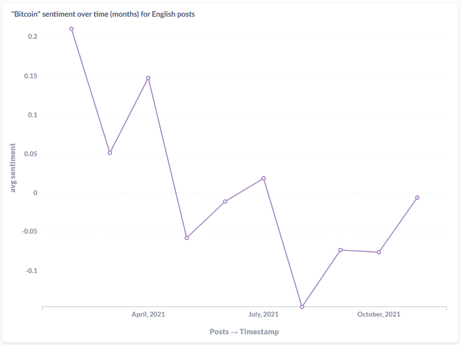

# bilge

Bilge is an NLP analysis service, specifically built to run NER and Sentiment analysis models on posts scraped using [mergen](https://github.com/humanova/mergen).

Using Redis pub/sub channels to recieve posts, PostgreSQL to store the analysis results. Redis is also used as a Message Broker to schedule NLP tasks for bilge workers to process. 

Altough easily modifiable, bilge has minimal 'data cleaning' features. This service was built according to my OSINT projects needs.



Examining the average monthly sentiment of posts in English that mention 'Bitcoin'.


Sample visualizations of news analysed between January-November 2021, in my Metabase dashboard. 

## Configuration 
Sample config file (config.json)
```json
{
    "db_name" : "posts",
    "db_user" : "user",
    "db_password" : "password",
    "db_host" : "127.0.0.1",
    "db_port" : 5432,
    "redis_host" : "localhost",
    "redis_port" : 6379,
    "redis_db" : "0"
}
```

## Models in use

Sentiment Analysis 
- [cardiffnlp/twitter-roberta-base-sentiment](https://huggingface.co/cardiffnlp/twitter-roberta-base-sentiment) (English)
- [savasy/bert-base-turkish-sentiment-cased](https://huggingface.co/savasy/bert-base-turkish-sentiment-cased) (Turkish)

Named Entity Recognition
- [Spacy's "en_core_web_trf"](https://spacy.io/models/en#en_core_web_trf) (English)


